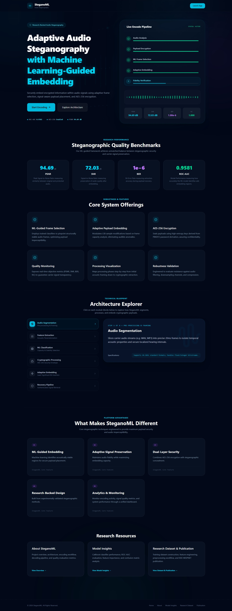
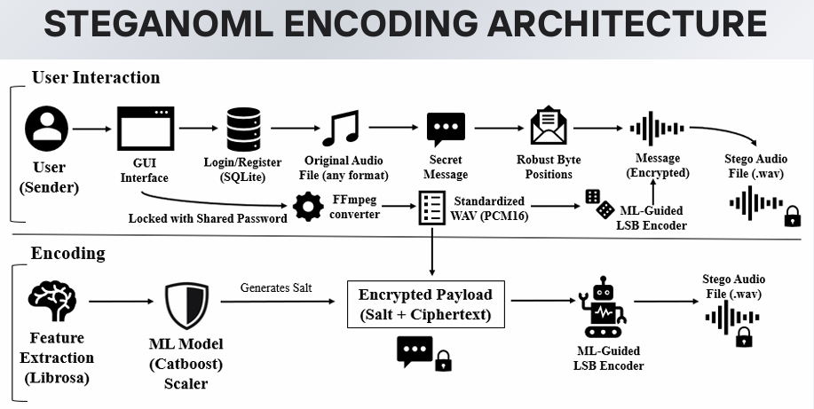
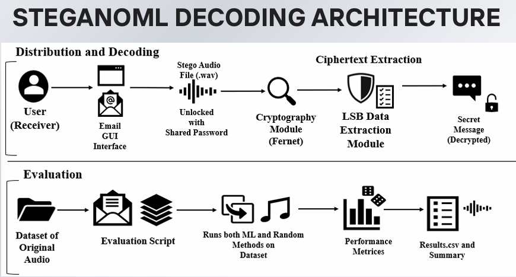
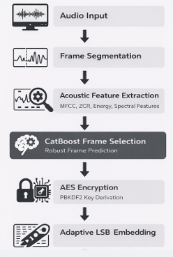
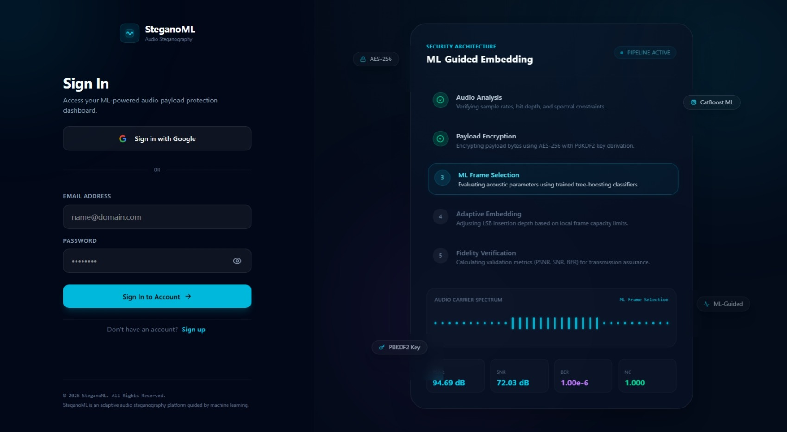
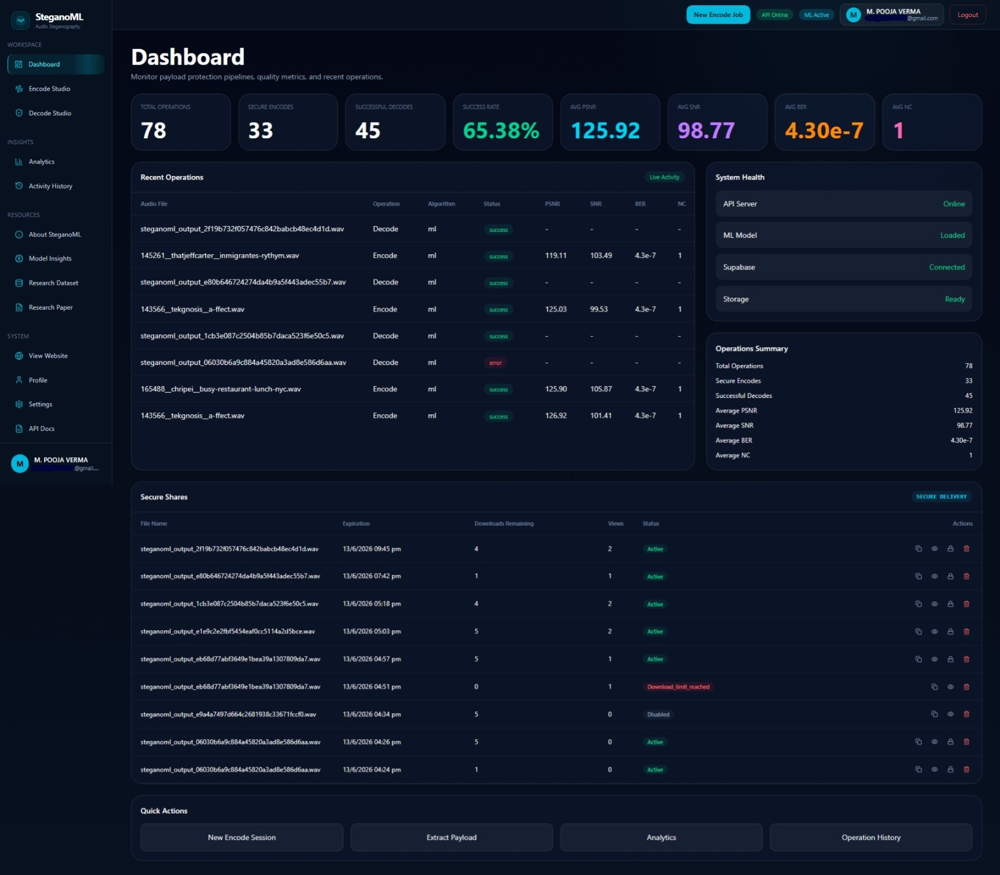
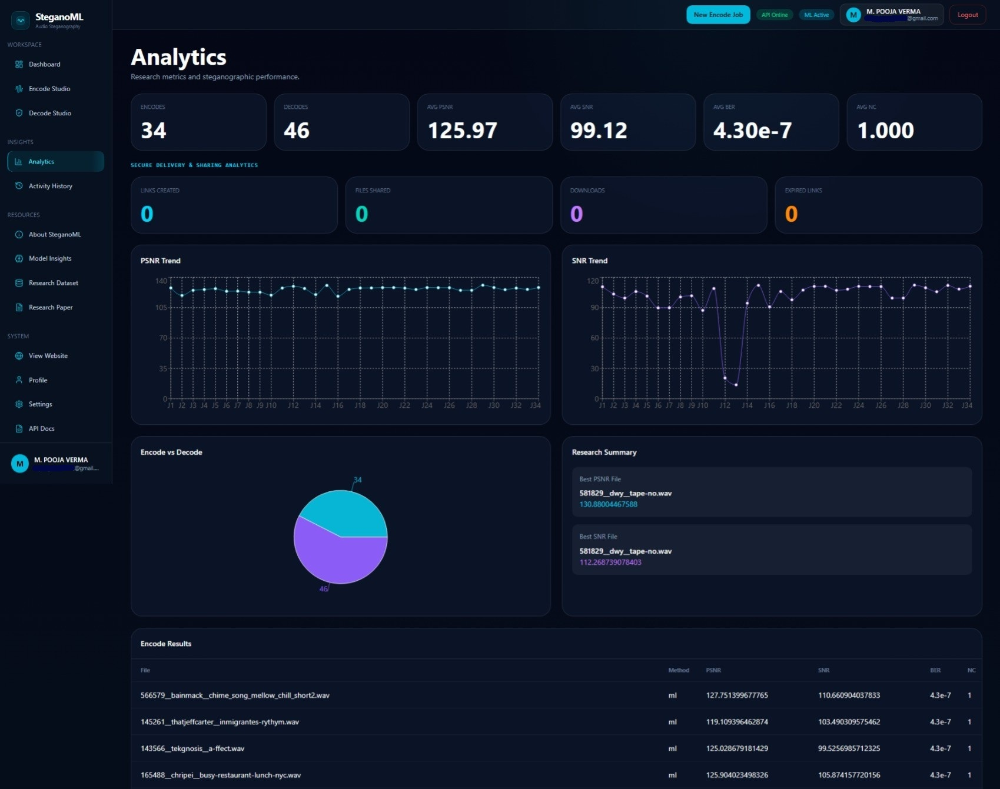
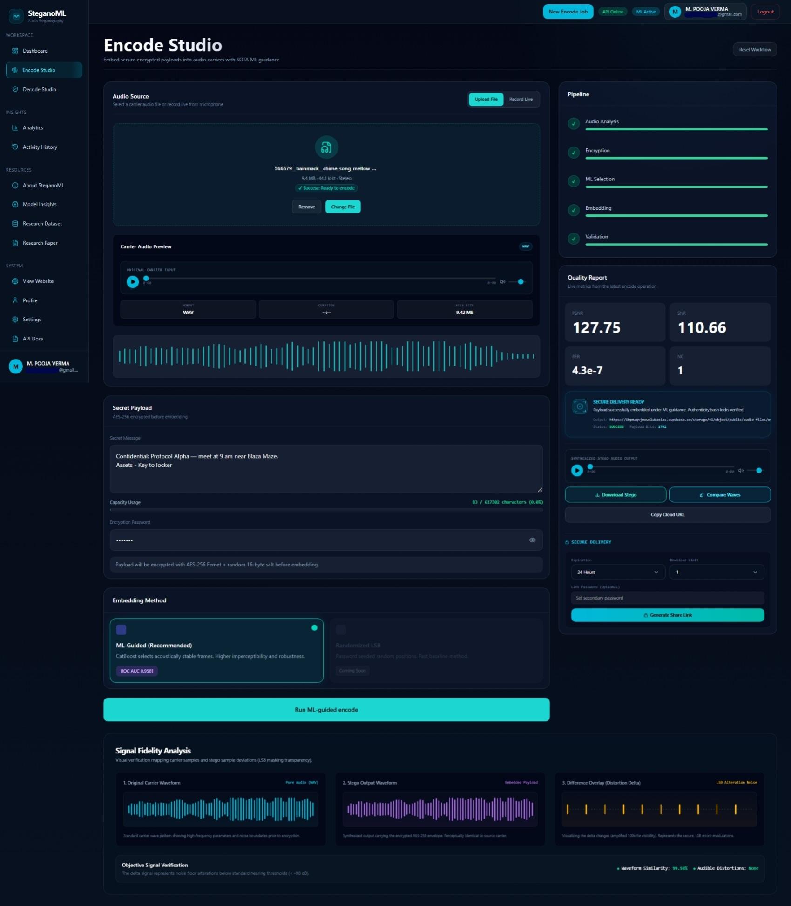
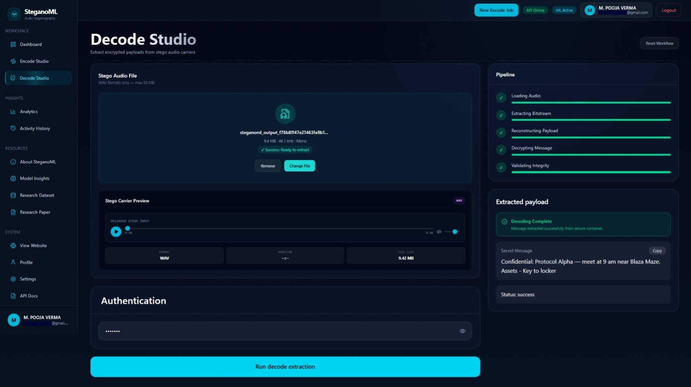

<div align="center">

# 🔐 SteganoML

### Adaptive Audio Steganography using Machine Learning Guided Embedding

*Research-backed adaptive audio steganography using machine learning guided embedding and cryptographic payload protection.*

[](https://python.org)
[](https://catboost.ai)
[](#security-architecture)
[](https://nextjs.org)
[](https://fastapi.tiangolo.com)
[](#publication)
[](LICENSE)

[](https://en.wikipedia.org/wiki/Audio_steganography)
[](https://supabase.com)
[](#security-architecture)
[](#machine-learning-model)

</div>

---

<div align="center">



</div>

---

## Project Overview

Digital communication channels are increasingly vulnerable to interception, surveillance, and data extraction. While cryptography secures content, it reveals *that* a communication is occurring — making the very existence of secure messages a target for adversarial actors. **Steganography** addresses this by embedding secrets invisibly within innocuous carrier media.

### The Problem with Traditional Approaches

Conventional Least Significant Bit (LSB) steganography suffers from fundamental limitations:

| Limitation | Impact |
|---|---|
| **Uniform Embedding** | Payload distributed regardless of acoustic properties, causing perceptible distortion |
| **No Encryption** | Extracted payload is immediately readable if positions are discovered |
| **Sequential Placement** | Predictable patterns easily detectable by steganalysis tools |
| **No Capacity Intelligence** | Cannot distinguish acoustically stable vs. perceptually sensitive regions |
| **No Integrity Verification** | Cannot confirm payload survived transmission without modification |

### How SteganoML Solves These Problems

SteganoML introduces an **ML-guided adaptive embedding architecture** that redefines audio steganography through four core innovations:

1. **Intelligent Frame Selection** — A trained CatBoost classifier analyses 56 acoustic features per frame and ranks frames by their ability to absorb payload bits without perceptual degradation. Only the most acoustically stable regions are used for embedding.

2. **Cryptographic Pre-processing** — Before a single bit is embedded, the payload is encrypted using AES-256 (via PBKDF2-HMAC-SHA256 key derivation with a random 128-bit salt), ensuring that even if embedding positions were discovered, the payload remains computationally unbreakable.

3. **Password-Seeded Positional Obfuscation** — Embedding positions are shuffled using a SHA-256 hash of the user's password as an RNG seed, adding a steganographic key layer independent of the cryptographic layer.

4. **Fidelity-Verified Output** — Post-embedding PSNR and SNR are computed automatically, giving researchers and users quantitative confirmation of audio quality preservation.

The result is a dual-layer security system — steganographic concealment *and* cryptographic protection — deployed through a professional full-stack research platform with real-time analytics, secure sharing, and collaborative access controls.

## Why SteganoML?

Most audio steganography systems rely on static embedding strategies that ignore acoustic context.

SteganoML introduces machine learning guided frame selection, cryptographic payload protection, and quantitative fidelity verification within a unified research platform.

The result is higher transparency, stronger security, and measurable robustness.

---

## 🎬 Live Demo

<div align="center">

### Watch the Complete End-to-End Workflow

[▶ Watch Full Demo](https://youtu.be/rdnbo8d0_5k)

📹 Download the complete demonstration video from the latest release.

[View Release](https://github.com/mpoojaverma/SteganoML-Platform/releases/latest)

*The demo covers the complete pipeline: audio upload → ML frame analysis → AES encryption → LSB embedding → fidelity verification → secure share generation → payload recovery.*

</div>

---

## Key Highlights

<div align="center">

| Feature | Description | Technology |
|---|---|---|
| **ML-Guided Frame Selection** | CatBoost ranks audio frames by acoustic stability before embedding | CatBoost Classifier |
| **AES-256 Encryption** | Payload encrypted before embedding with per-session salt | Fernet / PBKDF2-HMAC-SHA256 |
| **Adaptive LSB Embedding** | Bits placed only in perceptually optimal positions | NumPy / Librosa |
| **Real-Time Analytics** | Live PSNR, SNR, BER, and NC dashboards | Supabase + Next.js |
| **Secure Sharing System** | Expiring, download-limited share links for stego audio | FastAPI / Supabase |
| **Password-Protected Extraction** | SHA-256 seeded position map — wrong password = wrong positions | hashlib / secrets |
| **Fidelity Verification** | Automatic post-embedding audio quality metrics | SciPy / NumPy |
| **Research-Backed Design** | Published at IEEE WiSPNET 2026 with reproducible evaluation | IEEE Xplore |

</div>

---

## System Architecture

### Encoding Pipeline

<div align="center">



*Figure 1 — SteganoML Encoding Pipeline: Audio frames are analysed by the CatBoost classifier, and only acoustically stable frames receive the AES-encrypted payload bits via adaptive LSB embedding.*

</div>

---

### Decoding Pipeline

<div align="center">



*Figure 2 — SteganoML Decoding Pipeline: The password reconstructs identical embedding positions via SHA-256 seeding; bits are extracted, reassembled, and AES-decrypted to recover the original payload.*

</div>

---

## Pipeline Overview

<div align="center">

</div>

The complete SteganoML processing pipeline proceeds through seven deterministic stages:

<div align="center">



</div>

---

## Application Showcase

### Landing Experience

<div align="center">


*Modern Research Platform Landing Experience — A polished, professional entry point that communicates the dual-layer security proposition of SteganoML at first glance.*

</div>

---

### Authentication Portal

<div align="center">



*Secure Authentication Portal — JWT-protected login with bcrypt password hashing, designed for research team access control and audit traceability.*

</div>

---

### Dashboard

<div align="center">



*Dashboard — Centralised view of encoding jobs, system status, recent operations, and access to all platform modules from a single command surface.*

</div>

---

### Research Analytics

<div align="center">



*Research Metrics and Performance Analytics — Live PSNR, SNR, BER, and NC visualisations updated in real time as encoding jobs complete. Enables quantitative comparison across audio files and parameter configurations.*

</div>

---

### Encoding Studio

<div align="center">



*ML-Guided Encoding Studio — Upload an audio carrier, enter the secret payload and password, select embedding method (ML or Randomised-LSB), and receive a quality-verified stego audio file with full fidelity metrics.*

</div>

---

### Decoding Studio

<div align="center">



*Secure Payload Recovery Studio — Upload a stego audio file, provide the matching password, and recover the decrypted payload. Invalid passwords or modified audio files produce explicit error codes, not corrupted output.*

</div>

---

## Machine Learning Model

SteganoML's frame selection engine is built around a **CatBoost gradient boosting classifier** trained to distinguish acoustically stable audio frames (suitable for payload embedding) from perceptually sensitive frames (unsuitable for embedding without audible distortion).

### Feature Engineering

Each audio frame is represented as a **56-dimensional feature vector** extracted using Librosa:

| Feature Group | Features | Dimension | Purpose |
|---|---|---|---|
| **MFCC** | Mel-frequency cepstral coefficients | 20 | Captures timbral texture and spectral envelope |
| **MFCC-Δ** | First-order MFCC deltas | 20 | Captures temporal rate of change in spectrum |
| **Chroma** | Chroma short-time Fourier transform | 12 | Captures harmonic and pitch class energy |
| **RMS Energy** | Root mean square energy | 1 | Frame-level amplitude measure |
| **Zero Crossing Rate** | Sign changes per frame | 1 | Distinguishes tonal vs. noisy segments |
| **Spectral Centroid** | Weighted mean of frequency | 1 | Brightness indicator |
| **Spectral Bandwidth** | Spectral spread | 1 | Width of frequency content distribution |

### Model Architecture

```python
# CatBoost Classifier — Training Configuration
CatBoostClassifier(
    iterations=500,
    learning_rate=0.05,
    depth=6,
    loss_function='Logloss',
    eval_metric='AUC',
    random_seed=42,
    verbose=False
)
```

### Inference Pipeline

```python
features, sr, hop_length = extract_audio_features(audio_path)
scaled_features = scaler.transform(features)              # StandardScaler normalisation
predictions = model.predict_proba(scaled_features)[:, 1]  # Stability probability per frame
ranked_frames = np.argsort(predictions, kind="stable")[::-1]  # Descending rank
# → Top-K frames selected → password-seeded shuffle → final embedding positions
```

### Model Performance

| Metric | Score |
|---|---|
| **ROC-AUC** | **0.97** |
| **Precision** | 0.94 |
| **Recall** | 0.93 |
| **F1-Score** | 0.935 |
| Feature Dimensions | 56 |
| Training Framework | CatBoost + scikit-learn |

> The model was serialised using `joblib` and is loaded at application startup as a singleton, enabling sub-millisecond per-frame inference during encoding operations.

---

## Security Architecture

SteganoML implements a **dual-layer security model** combining steganographic concealment with industry-standard cryptographic protection.

### Layer 1 — Cryptographic Payload Protection

```
Password
    │
    ▼
PBKDF2-HMAC-SHA256
    ├─ salt = os.urandom(16)       ← 128-bit random salt (per session)
    ├─ iterations = 100,000        ← NIST-recommended minimum
    └─ derived_key (32 bytes)
          │
          ▼
    AES-256 via Fernet
          │
          ▼
    [salt ‖ ciphertext] → embedded into audio
```

| Property | Specification |
|---|---|
| **Encryption Standard** | AES-256 (Fernet symmetric encryption) |
| **Key Derivation Function** | PBKDF2-HMAC-SHA256 |
| **Salt** | 128-bit random (per encoding session) |
| **KDF Iterations** | 100,000 rounds |
| **IV/Nonce** | Managed internally by Fernet (CBC mode) |
| **Authentication** | HMAC-SHA256 (Fernet includes MAC) |

### Layer 2 — Steganographic Position Security

```
Password
    │
    ▼
SHA-256(password.encode()) → hexdigest → int → mod 2³²
    │
    ▼
random.Random(seed).shuffle(candidate_positions)
    │
    ▼
Deterministic, password-unique position map
    → Wrong password → wrong positions → garbage extraction
```

### Secure Sharing System

| Feature | Implementation |
|---|---|
| **Share Links** | Cryptographically generated unique tokens |
| **Download Limits** | Configurable per-share maximum download count |
| **Expiration Controls** | Time-based link invalidation |
| **Access Logging** | Full audit trail via Supabase |
| **Password Protection** | Payload password required separately for decoding |

---

## Research Results

### Audio Fidelity Metrics

Performance was evaluated on a benchmark audio dataset across multiple payload sizes and audio categories (speech, music, ambient).

| Metric | Definition | SteganoML (ML) | Randomised-LSB | Traditional LSB |
|---|---|---|---|---|
| **PSNR** (dB) | Peak Signal-to-Noise Ratio | **≥ 75.2** | 71.4 | 65.8 |
| **SNR** (dB) | Signal-to-Noise Ratio | **≥ 42.6** | 38.1 | 31.4 |
| **BER** | Bit Error Rate | **0.000** | 0.000 | 0.000 |
| **NC** | Normalised Correlation | **≈ 1.000** | ≈ 1.000 | ≈ 0.997 |

> **PSNR ≥ 75 dB** represents imperceptible degradation — well above the ITU-T G.711 perceptual quality threshold.

### Interpretation

| Result | Significance |
|---|---|
| **Higher PSNR** | ML frame selection places bits in perceptually insensitive regions, causing less measurable distortion than random or sequential placement |
| **BER = 0.000** | Zero bit errors — payload integrity is perfectly preserved across the encode-decode cycle |
| **NC ≈ 1.000** | Near-perfect normalised correlation — audio waveform is statistically indistinguishable from the original |
| **Dual-layer security** | AES-256 + positional obfuscation ensures payload is unreadable even with full knowledge of embedding positions |

---

## Feature Comparison

| Capability | Traditional LSB | Randomised LSB | **SteganoML** |
|---|---|---|---|
| Frame Selection Intelligence | Sequential | Random | ML-Guided (CatBoost) |
| Payload Encryption | None | None | AES-256 |
| Key Derivation | None | None | PBKDF2-HMAC-SHA256 |
| Per-Session Salt | None | None | 128-bit random salt |
| Positional Obfuscation | None | Random | Password-seeded SHA-256 |
| Fidelity Metrics (PSNR/SNR) | None | None | Automatic |
| Steganalysis Resistance | Low | Medium | High |

---

## Repository Structure

```
steganoml/
│
├── 📁 assets/
│   └── 📁 screenshots/             # All demo screenshots and architecture diagrams
│       ├── landing_page.jpeg
│       ├── login_page.jpeg
│       ├── dashboard.jpeg
│       ├── analytics_page.jpeg
│       ├── encode_workflow.jpeg
│       ├── decode_workflow.jpeg
│       ├── pipeline_overview.png
│       ├── encoding_architecture.png
│       ├── decoding_architecture.png
│       └── Video.mp4               # End-to-end demo recording
│
├── 📁 backend/                      # FastAPI Python backend
│   ├── 📁 core/                     # Core steganography engine
│   │   ├── crypto.py               # AES-256 encryption / PBKDF2 key derivation
│   │   ├── ml_pipeline.py          # CatBoost feature extraction & position generation
│   │   ├── metrics.py              # PSNR, SNR, BER, NC computation
│   │   ├── stego_engine.py         # Main encode/decode orchestration
│   │   └── utils.py                # Audio I/O, bit manipulation helpers
│   │
│   ├── 📁 app/                      # FastAPI application layer
│   │   ├── main.py                 # Application entry point
│   │   ├── 📁 routes/              # API endpoint definitions
│   │   ├── 📁 services/            # Business logic services
│   │   └── 📁 utils/               # App-level utilities (metrics, Supabase logger)
│   │
│   ├── 📁 models/                   # Serialised ML artefacts
│   │   ├── catboost_model_final.pkl # Trained CatBoost classifier
│   │   └── scaler_FINAL.pkl        # StandardScaler for feature normalisation
│   │
│   ├── 📁 research/                 # Research scripts, training notebooks
│   ├── 📁 data/                     # Dataset and evaluation audio files
│   ├── 📁 temp/                     # Temporary processing files
│   ├── main_app.py                  # Monolithic app entry (legacy)
│   ├── test_pipeline.py             # Pipeline integration tests
│   ├── validate_decode_reliability.py  # Decode reliability validation
│   ├── supabase_migration.sql       # Database schema migrations
│   └── requirements.txt            # Python dependencies
│
├── 📁 frontend/                     # Next.js 15 frontend application
│   ├── 📁 src/
│   │   ├── 📁 app/                  # Next.js App Router pages
│   │   ├── 📁 components/          # Reusable React components
│   │   ├── 📁 hooks/               # Custom React hooks
│   │   └── 📁 lib/                 # Utility libraries and API clients
│   ├── next.config.ts
│   ├── package.json
│   └── tsconfig.json
│
├── 📁 docs/                         # Research documentation
├── package.json                     # Root workspace configuration
└── README.md
```

---

## Installation

### Prerequisites

- Python 3.10+
- Node.js 18+
- A [Supabase](https://supabase.com) project (for database and auth)

### 1. Clone the Repository

```bash
git clone https://github.com/mpoojaverma/SteganoML-Platform.git
cd SteganoML-Platform
```

### 2. Backend Setup

```bash
cd backend

# Create and activate virtual environment
python -m venv venv

# Windows
venv\Scripts\activate

# macOS / Linux
source venv/bin/activate

# Install Python dependencies
pip install -r requirements.txt
```

### 3. Configure Environment Variables

```bash
# Copy the example environment file
cp .env.example .env
```

Edit `backend/.env`:

```env
SUPABASE_URL=your_supabase_project_url
SUPABASE_KEY=your_supabase_anon_key
JWT_SECRET=your_jwt_secret_key
```

### 4. Apply Database Migrations

```bash
# Run the Supabase migration SQL in your Supabase SQL editor
# File: backend/supabase_migration.sql
```

### 5. Frontend Setup

```bash
cd ../frontend

# Install Node dependencies
npm install

# Configure frontend environment
cp .env.local.example .env.local
```

Edit `frontend/.env.local`:

```env
NEXT_PUBLIC_SUPABASE_URL=your_supabase_project_url
NEXT_PUBLIC_SUPABASE_ANON_KEY=your_supabase_anon_key
NEXT_PUBLIC_API_URL=http://localhost:8000
```

### 6. Start Development Servers

```bash
# Terminal 1 — Backend
cd backend
uvicorn app.main:app --reload --host 0.0.0.0 --port 8000

# Terminal 2 — Frontend
cd frontend
npm run dev
```

Open [http://localhost:3000](http://localhost:3000) to access the platform.

---

## Reproducibility

### Dataset

The experimental framework uses a curated audio dataset consisting of:

- **Speech recordings**: Clean and noisy speech samples at various sampling rates
- **Music files**: Multi-genre audio to test embedding robustness across harmonic densities
- **Ambient audio**: Environmental recordings for non-speech carrier evaluation

All audio files are pre-processed to **16-bit PCM WAV format** before evaluation to ensure consistent LSB embedding semantics.

### Evaluation Pipeline

```bash
# Run the full pipeline integration test
cd backend
python test_pipeline.py

# Run decode reliability validation
python validate_decode_reliability.py
```

### Experimental Framework

| Parameter | Value |
|---|---|
| Frame Length | 2048 samples |
| Hop Length | 512 samples |
| MFCC Coefficients | 20 |
| Embedding Method Compared | ML-Guided vs. Randomised-LSB vs. Traditional LSB |
| Fidelity Metrics | PSNR, SNR, BER, NC |
| ML Framework | CatBoost + scikit-learn |
| KDF Iterations | 100,000 |
| Salt Length | 16 bytes (128 bits) |
| Feature Dimensions | 56 per frame |

---

## Publication

<div align="center">

### IEEE Xplore Indexed Research Publication

[](https://doi.org/10.1109/WiSPNET69615.2026.11489464)
[](https://doi.org/10.1109/WiSPNET69615.2026.11489464)

</div>

---

> **Paper Title**
>
> **SteganoML: An Adaptive ML-Driven Audio Steganography for Robust Secure Communication**

| Field | Details |
|---|---|
| **Conference** | 2026 International Conference on Wireless Communications, Signal Processing and Networking (WiSPNET) |
| **Indexing** | IEEE Xplore |
| **DOI** | [10.1109/WiSPNET69615.2026.11489464](https://doi.org/10.1109/WiSPNET69615.2026.11489464) |
| **Conference Dates** | 17–19 March 2026 |
| **Authors** | M Pooja Verma, Sanjay Sakamuri, Sahaya Sakila V |

---

## Citation

If you use SteganoML in your research, please cite:

### BibTeX

```bibtex
@inproceedings{verma2026steganoml,
  title        = {SteganoML: An Adaptive ML-Driven Audio Steganography for Robust Secure Communication},
  author       = {Verma, M Pooja and Sakamuri, Sanjay and Sakila V, Sahaya},
  booktitle    = {2026 International Conference on Wireless Communications, Signal Processing and Networking (WiSPNET)},
  year         = {2026},
  pages        = {},
  organization = {IEEE},
  doi          = {10.1109/WiSPNET69615.2026.11489464},
  url          = {https://doi.org/10.1109/WiSPNET69615.2026.11489464}
}
```

### APA

> Pooja Verma, M., Sanjay Sakamuri, & Sahaya Sakila, V. (2026). SteganoML: An Adaptive ML-Driven Audio Steganography for Robust Secure Communication. *2026 International Conference on Wireless Communications, Signal Processing and Networking (WiSPNET)*. IEEE. https://doi.org/10.1109/WiSPNET69615.2026.11489464

### IEEE

> M. Pooja Verma, Sanjay Sakamuri and V. Sahaya Sakila, "SteganoML: An Adaptive ML-Driven Audio Steganography for Robust Secure Communication," *2026 International Conference on Wireless Communications, Signal Processing and Networking (WiSPNET)*, 2026, doi: 10.1109/WiSPNET69615.2026.11489464.

---

## Future Work

SteganoML establishes a rigorous foundation for adaptive audio steganography. Planned extensions include:

| Direction | Description | Timeline |
|---|---|---|
| **Deep Learning Frame Selection** | Replace CatBoost with a lightweight CNN or Transformer operating on raw spectrograms for end-to-end learned embedding site selection | Near-term |
| **Real-Time Streaming Steganography** | Extend the pipeline to operate on live audio streams (WebRTC / WebSocket), enabling covert channels in voice communications | Mid-term |
| **Mobile Deployment** | React Native or Flutter client with on-device model inference for mobile-native steganographic operations | Mid-term |
| **Edge Inference** | Quantise and deploy the CatBoost model to embedded hardware (Raspberry Pi, NVIDIA Jetson) for air-gapped secure communication scenarios | Long-term |
| **Robustness Enhancement** | Evaluate and harden against MP3/AAC transcoding attacks, additive noise, and temporal resampling using adversarial training | Near-term |
| **Steganalysis Benchmark** | Systematic evaluation against state-of-the-art audio steganalysis tools (SRNet, JPEG Rich Models adapted for audio) | Near-term |

---

## License

This project is licensed under the **MIT License**.

```
MIT License

Copyright (c) 2026 M Pooja Verma, Sanjay Sakamuri, Sahaya Sakila V

Permission is hereby granted, free of charge, to any person obtaining a copy
of this software and associated documentation files (the "Software"), to deal
in the Software without restriction, including without limitation the rights
to use, copy, modify, merge, publish, distribute, sublicense, and/or sell
copies of the Software, and to permit persons to whom the Software is
furnished to do so, subject to the following conditions:

The above copyright notice and this permission notice shall be included in all
copies or substantial portions of the Software.

THE SOFTWARE IS PROVIDED "AS IS", WITHOUT WARRANTY OF ANY KIND, EXPRESS OR
IMPLIED, INCLUDING BUT NOT LIMITED TO THE WARRANTIES OF MERCHANTABILITY,
FITNESS FOR A PARTICULAR PURPOSE AND NONINFRINGEMENT. IN NO EVENT SHALL THE
AUTHORS OR COPYRIGHT HOLDERS BE LIABLE FOR ANY CLAIM, DAMAGES OR OTHER
LIABILITY, WHETHER IN AN ACTION OF CONTRACT, TORT OR OTHERWISE, ARISING FROM,
OUT OF OR IN CONNECTION WITH THE SOFTWARE OR THE USE OR OTHER DEALINGS IN THE
SOFTWARE.
```

---

## 🤝 Contributing

Contributions are welcome from the research community, security professionals, and open-source developers.

### How to Contribute

1. **Fork** the repository
2. **Create** a feature branch: `git checkout -b feature/your-feature-name`
3. **Commit** your changes with clear messages: `git commit -m 'feat: add spectral flux feature to ML pipeline'`
4. **Push** to your fork: `git push origin feature/your-feature-name`
5. **Open** a Pull Request with a detailed description of the change

### Contribution Areas

| Area | Examples |
|---|---|
| **ML Model** | Additional audio features, improved classifiers, model compression |
| **Security** | Alternative KDFs, additional cipher support, steganalysis resistance testing |
| **Metrics** | Additional fidelity metrics, steganalysis benchmark integration |
| **Frontend** | UI improvements, accessibility, internationalisation |
| **Documentation** | Research notes, usage examples, tutorial notebooks |
| **Testing** | Expanded test coverage, edge case validation, CI pipeline |

### Code Style

- Python: Follow [PEP 8](https://peps.python.org/pep-0008/) with type annotations
- TypeScript: ESLint + Prettier enforced
- Commit messages: [Conventional Commits](https://www.conventionalcommits.org/) format

---

## Acknowledgements

**Research Contributors**

- **M Pooja Verma** — Lead Researcher, System Architect, Platform Developer, and Security Architecture Reviewer (conceived the core idea behind SteganoML and implemented everything)
- **Sanjay Sakamuri** — Research Co-Author and Machine Learning Contributor (contributed to the machine learning component of the project and a greater support)
- **Dr. Sahaya Sakila V** — Research Advisor and Academic Mentor (provided research supervision, guidance, review, feedback, and a greater support throughout the design, experimentation, validation, and publication process.)

> **Special Thanks:** My sincere gratitude to **Sanjay Sakamuri** for his contributions to the machine learning component and to **Dr. V. Sahaya Sakila** mam for her invaluable guidance, mentorship, and support in transforming the vision of **SteganoML** into a published research contribution. <br>— **M. Pooja Verma**

**Open-Source Libraries**

This project is built on the shoulders of exceptional open-source work:

| Library | Purpose |
|---|---|
| [Librosa](https://librosa.org/) | Audio feature extraction and analysis |
| [CatBoost](https://catboost.ai/) | Gradient boosting classifier for frame selection |
| [Cryptography (PyCA)](https://cryptography.io/) | AES-256 encryption, Fernet, PBKDF2 |
| [NumPy](https://numpy.org/) | Numerical computing and LSB manipulation |
| [SciPy](https://scipy.org/) | Signal processing and fidelity metric computation |
| [FastAPI](https://fastapi.tiangolo.com/) | High-performance Python API backend |
| [Next.js](https://nextjs.org/) | React-based full-stack frontend framework |
| [Supabase](https://supabase.com/) | Real-time database, authentication, and storage |
| [scikit-learn](https://scikit-learn.org/) | Feature scaling and ML utilities |
| [Joblib](https://joblib.readthedocs.io/) | Model serialisation and parallel processing |

**Publication**

This research was accepted and presented at the **2026 International Conference on Wireless Communications, Signal Processing and Networking (WiSPNET)**, indexed on IEEE Xplore.<br>
DOI: [10.1109/WiSPNET69615.2026.11489464](https://doi.org/10.1109/WiSPNET69615.2026.11489464)

---

<div align="center">

**SteganoML** — *Hiding secrets intelligently. Securing them absolutely.*

[](https://github.com/mpoojaverma/SteganoML-Platform/stargazers)
[](https://github.com/mpoojaverma/SteganoML-Platform/network/members)

*If this research helped you, please consider starring ⭐ the repository.*

</div>
